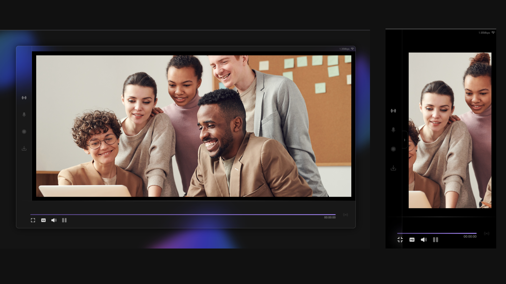

# Live Media Recorder App

## Preview

## Overview
The **Live Media Recorder App** allows users to stream video from their webcam and audio from their microphone, record the streams, and download the recorded files. The app is designed to provide a seamless user experience by managing permissions and offering various controls for media playback.

## Features
- **Permission Management**: On the first visit, the app prompts the user for webcam and microphone permissions, allowing choices for video, audio, or both. Permissions are saved in `localStorage` for future sessions.
  
- **Live Streaming**: Users can start streaming by clicking the stream button, which displays the live feed in HTML video/audio elements.

- **Media Controls**: Users can:
  - Play/Pause the stream
  - Mute/Unmute audio
  - Change video quality
  - Toggle fullscreen mode

- **Stream Management**: Users can manage their streaming data by:
  - Enabling/Disabling the microphone (with settings saved in `localStorage`)
  - Recording the stream
  - Downloading recorded content

- **Persistent Settings**: The app remembers user permissions for subsequent loads, ensuring a smooth experience.

## Technologies Used

### Languages
- **HTML**: For structuring the web application.
- **Sass/CSS**: For styling and responsive design.
- **JavaScript**: For handling media interactions and app functionalities.

### Tools
- **Gulp**: Used to compile Sass into CSS.

### APIs
- **HTMLMediaElement API**: Used for controlling video/audio elements (play, pause, mute, ...)
- **MediaDevices API**: Utilized via `getUserMedia()` to access the user's webcam and microphone.
- **MediaRecorder API**: Used for recording media streams.

## Usage
1. **Run the Application**: Open `index.html` on a local server or deploy it on GitHub Pages for live access.
2. **Grant Permissions**: The app will prompt you to allow access to your webcam and microphone.
3. **Start Streaming**: Click the stream button to begin live streaming.
4. **Control the Stream**: Use the provided controls to manage playback, recording, and settings.
5. **Download Recordings**: After recording, download your media files directly from the app.

## Flow of the App
1. **Permission Modal**: On the first visit, users are prompted to grant permissions for video and audio. The app saves these settings in `localStorage` for future sessions.
  
2. **Stream Start**: Users can start the stream by clicking the stream button, which utilizes the granted permissions to display the live feed.

3. **Media Controls**: Users can play/pause, mute/unmute, change quality, and toggle fullscreen for the streaming media.

4. **Manage Streaming Data**: Users can enable/disable the microphone, record the stream, and download the recorded content.

5. **Persistent Permissions**: The app remembers the granted permissions for subsequent loads, ensuring a consistent user experience.

## Additional Features
- **Elapsed Time Display**: The app shows the elapsed time of the recording below the video.
- **Responsive Layout**: The app is designed to work seamlessly on both desktop and mobile devices.
- **Interactive Icons**: Icons change dynamically based on user interactions, enhancing the user experience.

## Browser Compatibility
The MediaRecorder API is supported in most modern browsers, including:
- **Chrome**: Supported from version 49
- **Firefox**: Supported from version 29
- **Safari**: Supported from version 14.1
- **Edge**: Supported from version 79

For detailed compatibility information, refer to the [Can I use](https://caniuse.com/mediarecorder) website.

## Contact
For any inquiries or feedback, feel free to reach out to me at [aiparsa83@gmail.com](mailto:aiparsa83@gmail.com).

---

Enjoy streaming and recording with the Live Media Recorder App!
